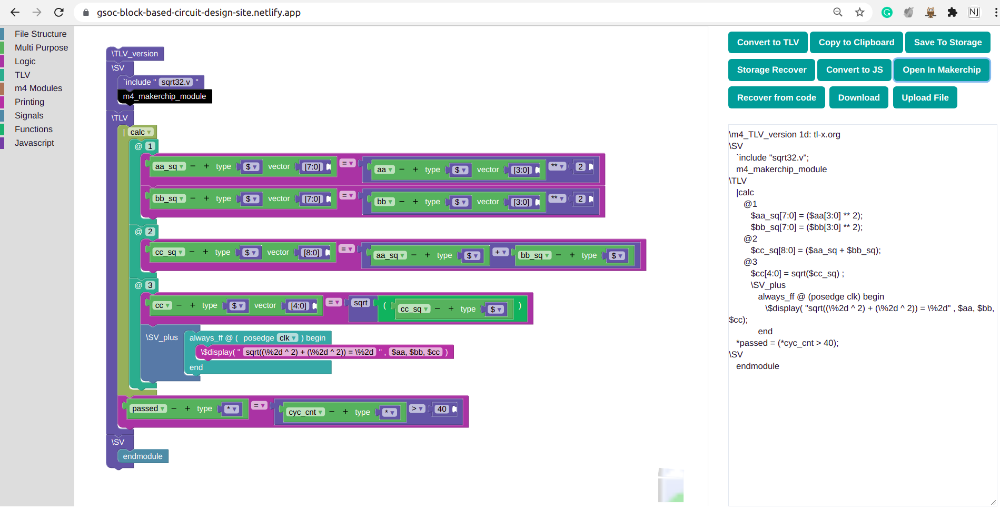
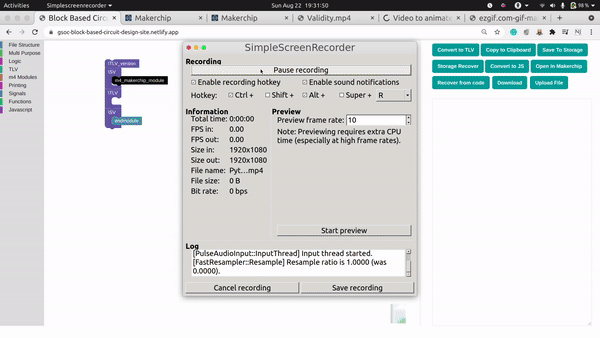

# Block Based Circuit Design

This summer I was mentored by the FOSSi Foundation to develop a Block Based Circuit Design Solution using blockly by google. I am excited to introduce to you the result! 


<a href="https://gsoc-block-based-circuit-design-site.netlify.app/"></a>

### How to Run

1. **To Design Circuits** 
   * Go to [Block Based Circuit Design](https://gsoc-block-based-circuit-design-site.netlify.app/) and start designing!
2. **To contribute to Block Based Circuit Design Development**
   
``` 
   git clone https://github.com/ninja3011/Block_Based_Circuit_Design.git
   cd Block_Based_Circuit_Design/src
   npm start
```


## Motivation

Block-Based Circuit Design introduces learners to circuit design at a young age. The current options available for circuit design like Verilog and VHDL are syntactically hard for the younger learners to grasp. TL-Verilog, a variation of Verilog helps eliminate this complexity from the languages while preserving its advantages. 

Block Based Circuit Design takes it a step further. By Gamification of the learning and working process, it makes learning and tinkering with Circuit design fun. Further tearing down barriers to entry to the field.

### The Power Of Block Based Circuit Design

With the Aid of Block Based Circuit Design, we finally have a tool for nurturing the circuit designer inside of younger learners. For a long time, the community lacked a good solution for introducing and catching the interest of circuit design due to lack of appropriate tools. With this solution, **anyone can design circuits**. The codebase implements a TL-Verilog Generator which converts the blocks to a TL-Verilog code. This code can also be further converted to Verilog in [MakerchipIDE](https://www.makerchip.com/sandbox/#) using sandbox. 

## Demo


|**Proposed Deliverables**                                             |**Status**   | 
|----------------------------------------------------------------------|------------:|
| Designing the required tool list for the interface.                  | Delivered   |
| Create a working custom Language Generator for TL-Verilog on Blocky. | Delivered   |
| Adding instructions to the language generator to handle more tasks   | Delivered   | 
| Exploring and possibly implementing big string text inputs in Blocky | Delivered   |


### The Technologies used in the Project include:
- Blockly
- TL-Verilog
- React
- Chakra-UI
- Core JavaScript and JSON
- netlify for deployment
- MakerchipIDE

### Why Blockly?

Blockly has many advantages which made it an ideal choice for our solution: 
  * Open Source, I was able to peek into the source code for the 5 basic languages and extrapolate how to go about developing one for TL-Verilog.
  * Can handle long text, Blocks in blockly have a capability to handle multiline texts with formatting.
  * Extensible, Blockly is meant to be added on to. They have made it really simple to add and remove functionalities from the library.
  * Purely based in JavaScript, so no conversion complications
  * 100% client side. It has no server side dependencies.
  * Compatible with all major browsers: Chrome, Firefox, Safari, Opera, and IE.
  * Highly customizable and extensible.

### The TL-Verilog Revolution

TL-Verilog has been developed by addressing the complaints a lot of circuit designers in the industry have voiced for a long time. TL-verilog simplification is akin to that python brought in Software Development. The industry standard languages of Verilog and VHDL, though powerful, interact with the hardware at a very low level and make the code unnecessarily complex. TL-Verilog eliminates the archaic aspects of theses languages while improving on their functionalities. The intuitive simplicity of TL-Verilog along with the availability of tools which convert it to Verilog made it an ideal choice

### Code Structure

```
├── App.css
├── App.js
├── components
│   ├── BlocklyComponent
│   │   ├── BlocklyComponent.jsx
│   │   └── index.js
│   ├── Panel.js
│   └── toolbox.js
├── generator
│   ├── Components.js
│   ├── Expressions.js
│   ├── fileStructure.js
│   ├── m4Modules.js
│   ├── MultiPurpose.js
│   ├── Printing.js
│   ├── Procedures.js
│   ├── Scopes.js
│   ├── Sequential.js
│   ├── Signals.js
│   ├── Ternary.js
│   └── tl_verilog.js
└── index.js
```

The Code went through a lot of rounds and I took to recode everything again from scratch post the 1st evaluation. This was done to deliver the most efficient solution for the product. 

In our src we have :
```
├── components
├── generator
├── App.css
├── App.js
└── index.js
```

Using React, we have taken benefit of the states and props to maintain the memory of blocks during operation. All states can be viewed in App.js as they have been lifted up and are passed to the components as required.

State Flow diagram
```
App.js
├──  BlocklyComponent.jsx
├──  Panel.js
```

The **components folder** holds the code for the three main sections of our solution:
  - Toolbox (Leftmost)
  - Blockly Workspace(middle)
  - Panel (rightmost)
  
These folder contain the necessary logic to render and handle any changes made by the user on these specific areas. These can be thought of as canvases for their individual zones

The **generator folder** carries the description and logic for all the blocks that the Designer is equipped with. 

The *tl-verilog.js* file defines our custom generator and the rules attached with it :
- Precedence of commands
- index of each block
- variables database storage
- scrubbing of multiple block codes together
All of these are bundled together in tl-verilog.js file which helps us define our language specification for TL-Verilog


## Daily Tracker

|     Start Date  |          Updates                                    |
|-----------------|:---------------------------------------------------:|
|  [ 2020-08-19 ] |[Week 12](https://ninadjangle.tech/pages/gsoc/wk12)  |
|  [ 2020-08-12 ] |[Week 11](https://ninadjangle.tech/pages/gsoc/wk11)  | 
|  [ 2020-08-5  ] |[Week 10](https://ninadjangle.tech/pages/gsoc/wk10)  |
|  [ 2020-07-29 ] |[Week 9](https://ninadjangle.tech/pages/gsoc/wk9)    | 
|  [ 2020-07-22 ] |[Week 8](https://ninadjangle.tech/pages/gsoc/wk8)    | 
|  [ 2020-07-15 ] |[Week 7](https://ninadjangle.tech/pages/gsoc/wk7)    | 
|  [ 2020-07-8  ] |[Week 6](https://ninadjangle.tech/pages/gsoc/wk6)    | 
|  [ 2020-07-1  ] |[Week 5](https://ninadjangle.tech/pages/gsoc/wk5)    | 
|  [ 2020-06-24 ] |[Week 4](https://ninadjangle.tech/pages/gsoc/wk4)    | 
|  [ 2020-06-18 ] |[Week 3](https://ninadjangle.tech/pages/gsoc/wk3)    | 
|  [ 2020-06-11 ] |[Week 2](https://ninadjangle.tech/pages/gsoc/wk2)    | 
|  [ 2020-06-4  ] |[Week 1](https://ninadjangle.tech/pages/gsoc/wk1)    |
|  [ 2020-05-27 ] |[Week 0.2](https://ninadjangle.tech/pages/gsoc/wk0_2)|
|  [ 2020-05-20 ] |[Week 0.1](https://ninadjangle.tech/pages/gsoc/wk0_1)|


## Work Done

- [Github Repository](https://github.com/ninja3011/Block_Based_Circuit_Design)
- [Website](https://gsoc-block-based-circuit-design-site.netlify.app/)
- [Daily Tracker](https://ninadjangle.tech/gsoc-2021) 

## Contributers

- Dr. Gayatri Mehta
- Steve Hoover
- Adam Ratzman
- Ninad Jangle

